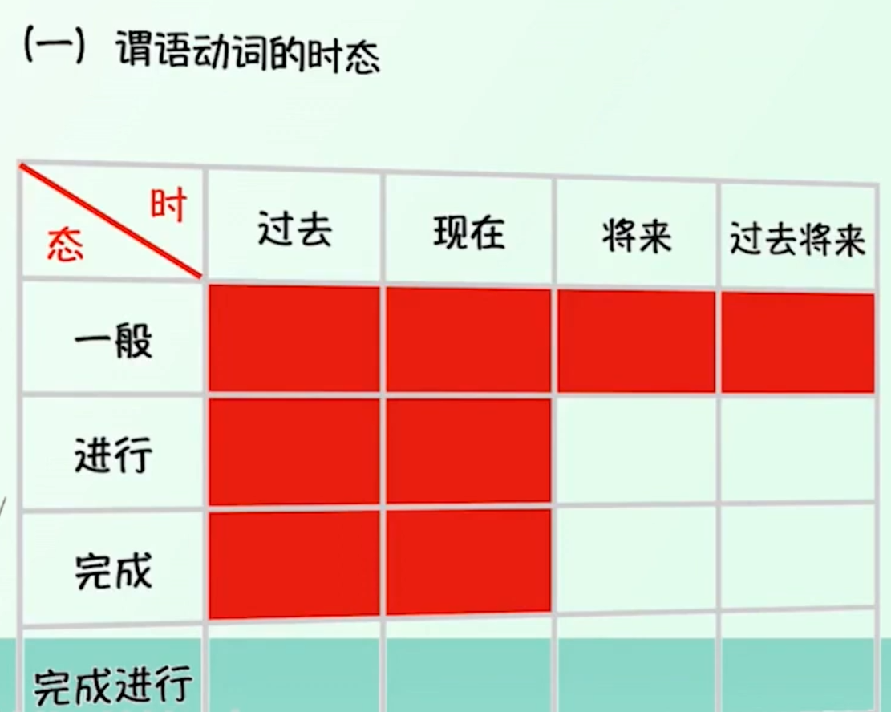
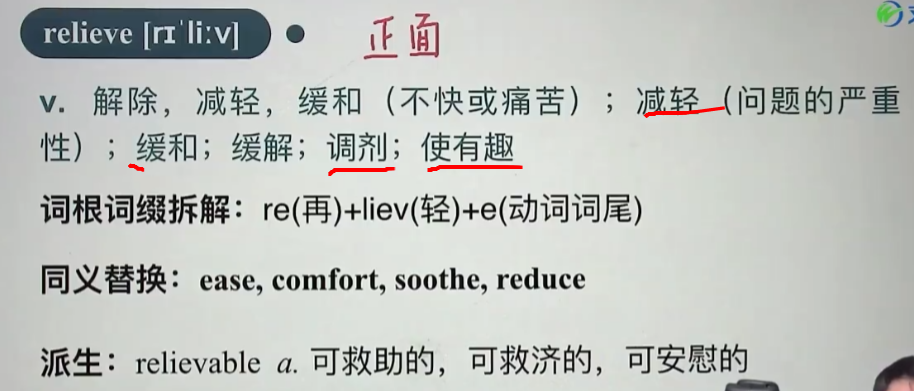
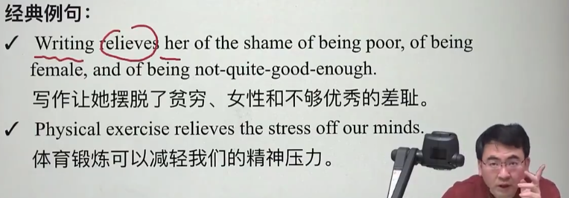
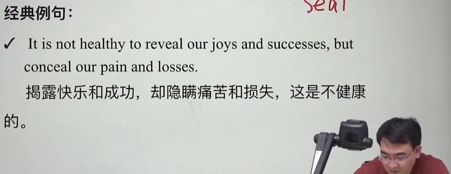
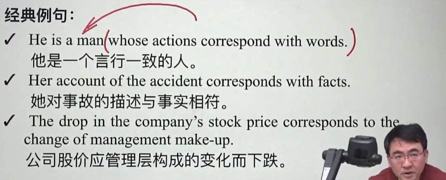
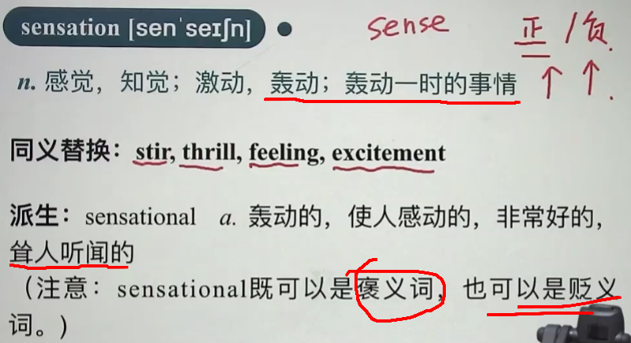
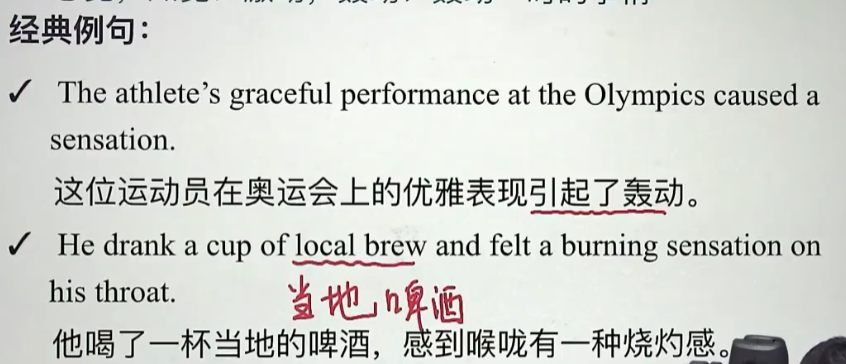
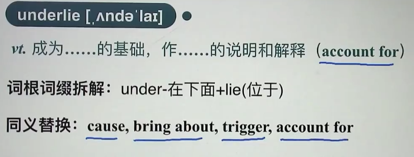
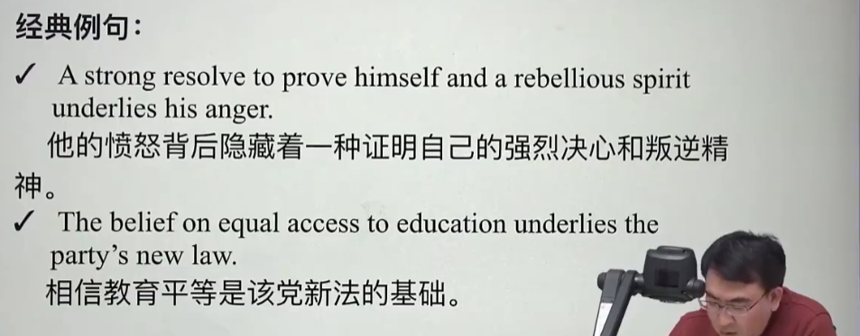

# 英语一语法

## 05

谓语动词的**时态**：

1. **一般现在时 （do/does; is/am/are）**

> 表示经常性、习惯性动作。

主将从现：在时间、条件和让步状语从句中经常用一般现在表示将的来事情。（爷青回）

例：If it rains tomorrow, we will stay at home.

2. **现在进行时(am/is/are doing)**

3. **过去进行时(was/ were doing)**

表示在过去一个具体的时间正在发生的动作。

例：Mary was listening to light music 10 minutes ago.

持续动词的过去进行时只有在有过去将来的时间状语或过去将来的语境下才能表示过去将来。

例：She said that she was travelling the next day.

4. **一般将来时(will do/be going to do)**

5. **将来进行时(will be doing)**

强调在将来的某个具体时间正在发生的动作或存在的状态。

例：Don't worry, you won't miss her. She will be wearing a red T-shirt and a white skirt at that time.

6. **一般过去时 (did; was/were)**

7. **现在完成时(have/has done)**

①表示动作到现在为止已经完成或刚刚完成，强调对现在产生的影响。

例：I bought a new house, but I haven't sold my old one yet, so at the moment I have two houses.

②表示从过去某时刻开始，持续到现在的动作或情况，并且有可能会继续延续下去。此时经常用延续性动词。

时间状语常用since加一个过去的时间点，或for加一段时间，或by加一个现在时间。

例：Great as Newton was, many of his ideas have been challenged today and are being modified by the work of scientists of our time.

8. **过去完成时(had done)**

①表示在过去的某个时间或动作以前已经完成的动作或已经存在的状态。就是我们常说的"过去的过去"。

Until then, his family hadn't heard from him for six months.
到那时为止，他家里已经有六个月没得到他的消息了。

②表示从过去的过去开始，持续到过去的动作或情况，并且有可能会继续延续下去。此时经常用延续性动词。

By the time I left the school, he had taught the class for 3 years.

到我毕业时,他已经教那个班三年了.

# 逐词过关

relieve

conceal --反义 reveal

correspond

sensation

underlie

