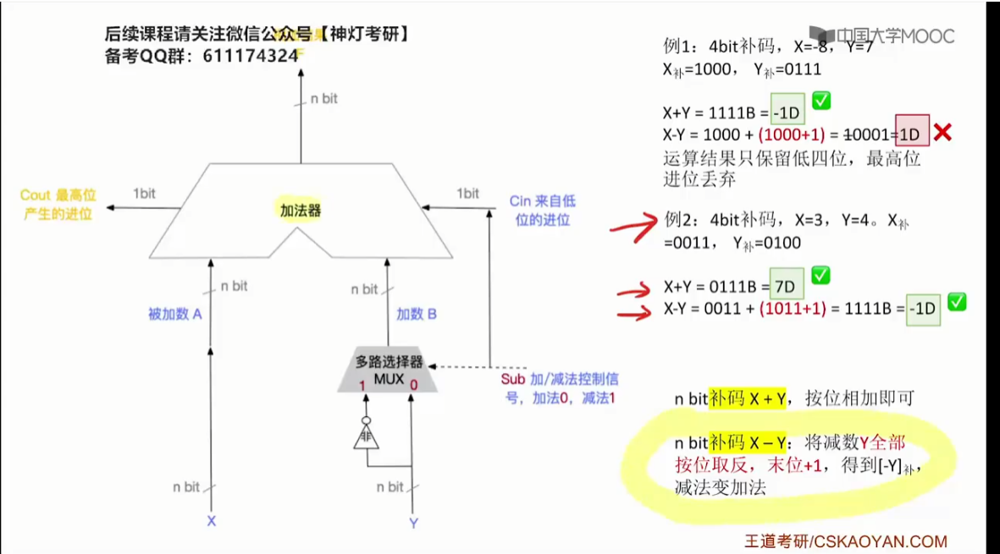
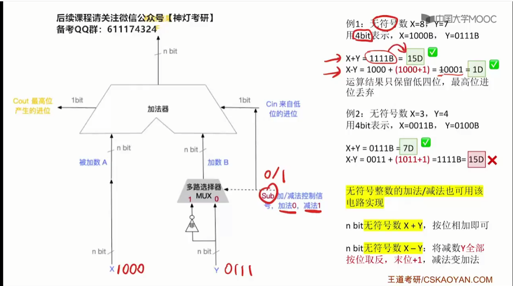
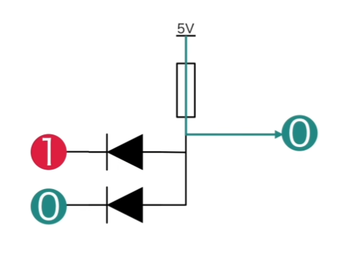
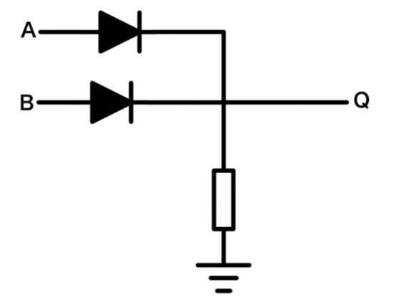
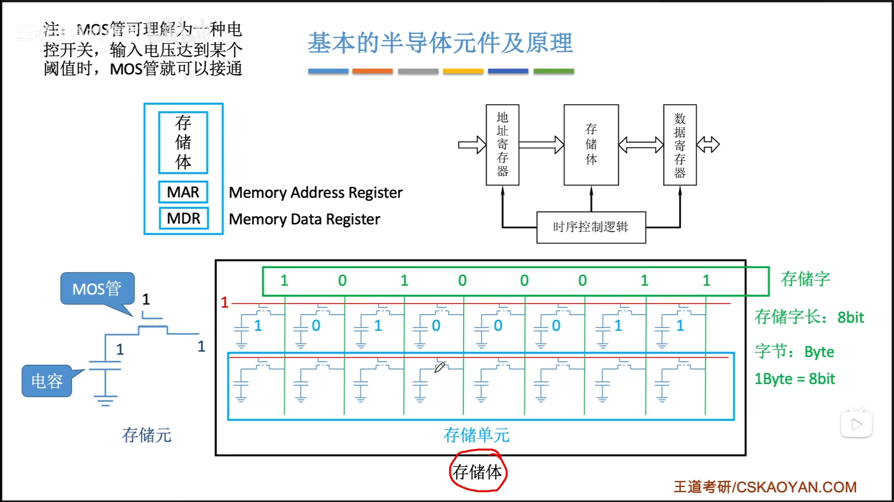
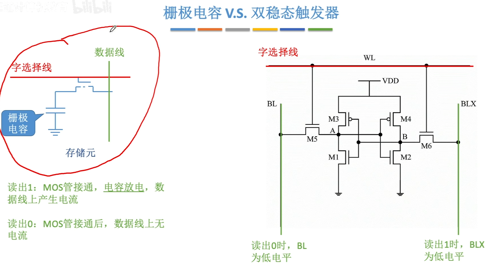
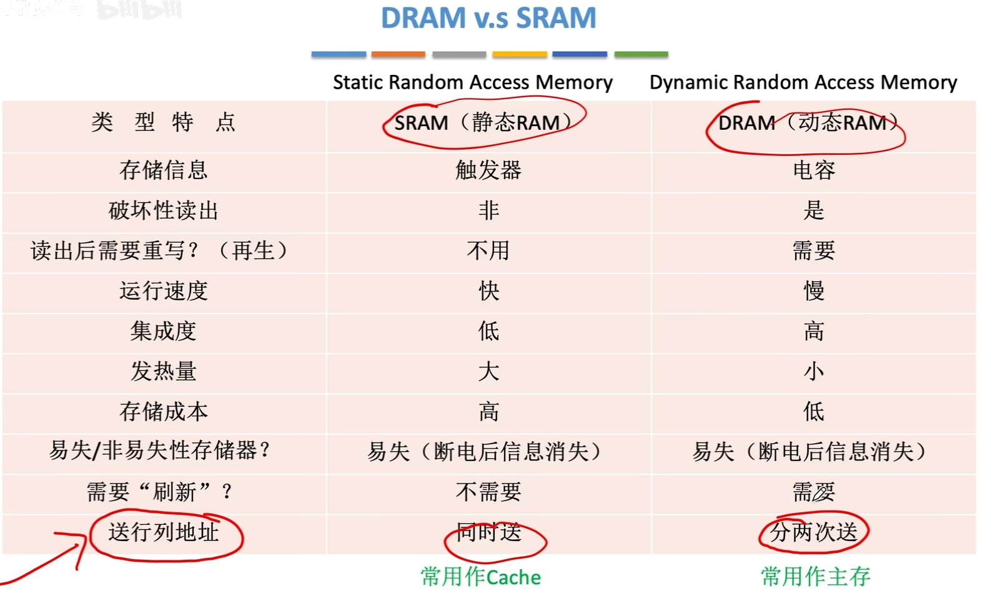
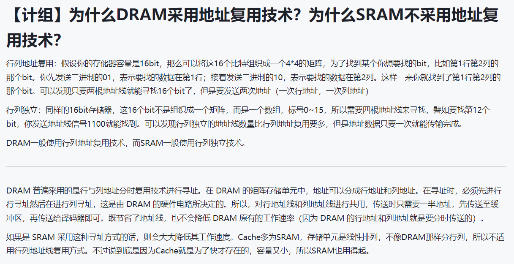

# 第二章

**与门电路的实现**

**或门**

## 计组第二章总结：数据的运算和表示

**1**、**数制和编码**

**2**、**运算方法和运算电路**：加法器、定点数的加减乘除

**3**、**浮点数的运算：**IEEE754标准

# 第三章：存储系统

**DRAM v.s SRAM**

栅极电容 DRAM

双稳态触发器 SRAM

常考点，

DRAM地址复用技术

[DRAM 为什么采用地址复用技术](https://www.cnblogs.com/exungsh/p/15957909.html)

